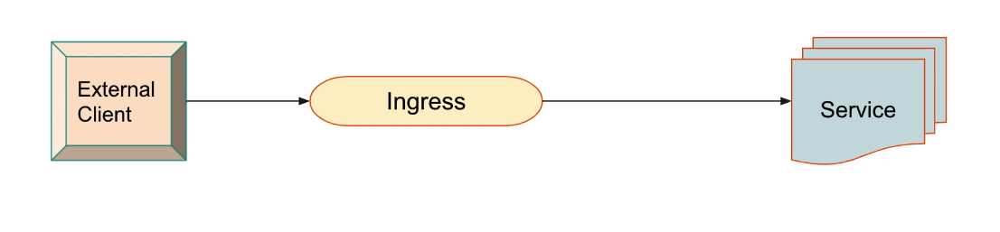
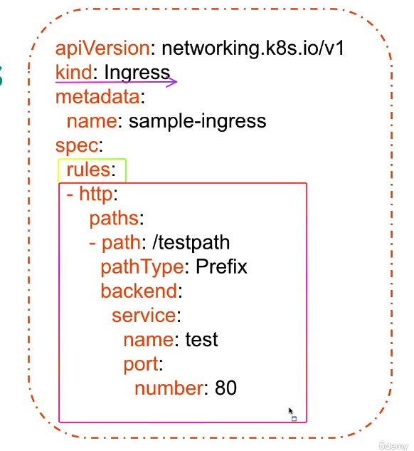

# Módulo 3: Git Quick Start

Configurando usuario y email en git

    git config --global user.name "Nombre Usuario"
    git config --global user.email "Correo"
    git config --list

Creando un nuevo proyecto

    git init

Crea un directorio .git para verlo puede usar el comando ls -a
Al realizar un git commit, obtenemos la siguiente respuesta

    git commit 

    On branch master   -> La rama actual

    Initial commit     -> El primer commit

    nothing to commit  -> No hay cambios para commit

Procedemos a agregar un archivo a nuestro proyecto

    touch nuevo.txt

Validar el estado en el que está el arhivo

    git status

    ------------------------------------------------------------
    On branch master
    
    No commits yet

    Untracked files:
    (use "git add <file>..." to include in what will be committed)
            nuevo.txt

    nothing added to commit but untracked files present (use "git add" to track)    

Esto quiere decir que el archivo nuevo.txt no está en el repositorio, por lo cual no se le hace seguimiento a sus cambios por lo que se debe agregar al seguimiento

    git add nuevo.txt

Ahora vemos el estado actual

    git status

    ------------------------------------------------------------
    On branch master

    Changes to be committed:
        new file:   nuevo.txt    -> Se agregó el archivo nuevo.txt al staging area

Para agregar de una vez todos los archivos

    git add .

Agrego los cambios al staging area

    git commit -m "Primer commit"

Ahora validamos el estado.
    
        git status
    
        ------------------------------------------------------------
        On branch master
        nothing to commit, working tree clean

Al agregar contenido a un archivo ya existente y ver el estado

    echo "Esto es una prueba" >> nuevo.txt

    git status

    ------------------------------------------------------------
    Changes not staged for commit:
    (use "git add <file>..." to update what will be committed)
    (use "git restore <file>..." to discard changes in working directory)
            modified:   nuevo.txt

    no changes added to commit (use "git add" and/or "git commit -a")

Para ver los cambios realizados en el archivo

    git diff

Ahora para agregar los camibos realizados al staging area, debemos agregar el archivo y volver hacer el commit

    git add nuevo.txt
    git commit -m "Segundo commit"

    git status

Procedamos a agregar un nuevo archivo segundo.txt, modificar el archivo nuevo.txt y veamos el estado.

    touch segundo.txt
    echo "Esto es una prueba" >> segundo.txt
    echo "Esto es una prueba" >> nuevo.txt

    git status

    ------------------------------------------------------------
    On branch master
    Changes not staged for commit:
    (use "git add <file>..." to update what will be committed)
    (use "git restore <file>..." to discard changes in working directory)
            modified:   nuevo.txt

    Untracked files:
    (use "git add <file>..." to include in what will be committed)
            segundo.txt

    no changes added to commit (use "git add" and/or "git commit -a")

Con esto podemos observar como se hace seguimiento por separado de los archivos, agreguemos todos los archivos 

    git add .
    git status
    ------------------------------------------------------------
    On branch master
    Changes to be committed:
    (use "git restore --staged <file>..." to unstage)
            modified:   nuevo.txt
            new file:   segundo.txt

Podemos hacer un git log para ver los ultimos 10 commits

    git log

Podemos hacer un git log -p para ver los commits con el contenido de los archivos

    git log -p

Tambien podemos listar por usuario

    git log --author="javi cisneros"

**Nota:** Después que un un archivo  a sido agregado una vez, de ahora en adelante hacer el commit en la misma linea se puede hacer de la siguiente manera

    git commit -am "Tercer commit"

# Módulo 4: Git Con GitHub

Creando una nueva branch(rama)

    git branch nueva_rama
    git switch nueva_rama
    git push origin dev
    
 Los archivos que agregues cuando estes en la rama nueva_rama, no se agregaran al repositorio de GitHub, solo a la rama nueva_rama. Incluso tampoco serán visibles a nivel de sistema operativo. 

    git checkout -b nueva-rama
    
## Eliminando una rama

    git branch -d nueva_rama
    git push origin --delete nueva_rama

## Git reset vs Git revert

**Reset** -> Se puede asociar a un rollback. Es decir, si se produce un error en un commit, se puede revertir a ese commit en nuestro ambiente local. ()
**Revert** ->  Agrega un nuevo commit al final de la cadena de commits. 

En resumen, git reset es cuando lo cambios aun estan en local , git revert es cuando ya se han hecho push.

## Git reset
### RESET SOFT:

Borra el commit pero no quita el contenido del archivo.
```
git log --oneline
git reset --soft f60dc2e
```
Si hacer un git status va a ver que hay archivo pendiente de commit.

### RESET HARD:

Restaura los archivos a su estado anterior. (Justo cuando se hizo el commit)

    git reset --hard f60dc2e

## Git revert

Deshace un commit y pusha el cambio al repositorio de GitHub.

    git revert HEAD
    git push 

## Identificar cambion entre WORKING y STAGING AREA

Un archivo especifico puede hacerce con. 
    
    git diff Nombre_del_archivo

Todos loa archivos

    git diff

## Módulo 4: Git Compare Commits

    git diff f60dc2e f60dc2f

# Módulo 6: Staching Area

En esta área se alamacenan temporamente los archivos locales, sin enviarlos al repositorio. Muy practico cuando se está realizando un cambio pero por urgencia es neesario trabjar en un Fix. haciendo el git stash, se guardan los cambios en una rama temporal y podemos arreglar el bug, hacer commit push y luego volver al stash sin perder los cambios.

    git stash                           # Guarda los cambios en una rama temporal

    git stash list                      # Lista las ramas temporales
    git stash apply nombre_del_stash    # Aplica los cambios de la rama temporal

Finalmente tendríamos que borrrar los cambios que estan en el stash

    git stash drop nombre_del_stash

Para el caso en que se haya creado un creado un archivo y este no se encuentre en tracked files, se puede hacer un git stash -a para que se agregue este archivo tambien al area de stach.

    git stash -a ARCHIVO_A_AGREGAR  # Agrega el archivo al area de stach

Almacenando un stash con un mensaje

    git stash save "Mensaje"

Cambios hechos en un stash especifico

    git stash show nombre_del_stash


# Kubernetes -> Modulo 32 

Crear un deployment usando kubectl sin yaml 

```
kubectl create deployment hello-node --image=k8s.gcr.io/echoserver:1.4
```
 Lo anterior crea el  Deployment replicaSet y el Pod.

El anterior servicio lo podemo exponer usando kubectl expose 

```
kubectl expose deployment hello-node --type=LoadBalancer --port=8080
``` 

Validamos que el servicio esta disponible

```
kubectl get service hello-node
```

En el caso de usar docker-desktop, podemos ver el servicio en el siguiente link https://localhost:8080/.
Para el caso de usar minikube, podemos ver el servicio usuando el comando 

```
minikube service hello-node
```

Para borrar el servicio y deployment

```
kubectl delete deployment hello-node
kubectl delete service hello-node
``` 
 
 TODO: DIGITALOCEAN

## ConfigMap

Creando un configmap por comando 

```
kubectl create configmap pruebascommand --from-file /Users/javing77/Documentos/cursos/Kubernetes/DevopsMasterClass/index.html
```

Aplicando un ConfigMap por Yaml

```
kubectl apply -f ConfigMaps/example-configMap.yml

```

## Deployment 
Cambiar una imagen en un deployment

```
kubectl set image deployment/hello-node hello-node=k8s.gcr.io/echoserver:1.4
``` 


## Secret

Similar al configmap pero con datos privados

```
kubectl create secret generic db-user-pass --from-file=userdb.txt --from-file=password.txt
```

## Leyendo un ConfigMap y un Secret en un Pod

Se puede asignar en la sesion de env de un pod una variable con el valor de un configmap o un secret

ConfigMap : container.env.name.configMapKeyRef  {name: Camp definido En el configmap, key: Campo definido en el configmap} 
Secret : container.env.name.secretKeyRef  {name: Camp definido En el configmap, key: Campo definido en el configmap}

```
kubectl create -f ConfigMaps/configmap-env-demo.yml
```

## Poxis ConfigMap Cargar todas las valariables de una vez

Se crea un configMap con las variables y se le asigna a un pod este configMap envFrom 

```
kubectl create -f ConfigMaps/configmap-poxis-configMap.yml
```

# RestarPolicy

en el archivo [restarPolicies.yml](HealthCheck/restarPolicies.yml) encontrará ejemplos detallados de como funcionan los restarpolicies 

### Escalar manualmente un ReplicaSet

  
  ```
  kubectl scale  rs rs-frontend --replicas=3
  ```

 # LifeCycle de un pod

 ## Estados de un pod
 1. Pending: El pod ha sido aceptado por Kubernetes pero no se ha podido ejecutar (container). 
 2. Running: El pod es schedulado y todos sus containers han sido creados y almenos uno se encuentra corriendo.
 3. Succeeded: El pod ha terminado satisfactoriamente en estado 0.
 4. Failed: El pod ha terminado con un estado no 0.
 5. CrashLoopBackOff: El pod ha fallado y está intentando volver a ejecutarse.


 # Kubernetes Networking
 # Ingress
 


********************************************************
        PARA HACER EN DIGITALOCEAN :

        168, 170, 171, 175, 176, 194, 199, 217 

********************************************************
Commands : SetUp K8s HA Cluster (Updated)

    Due to Docker Version Update, Kubernetes Installation Process changed a bit, compared to as we shown in the last Lecture. We have updated the commands below, please follow in given sequence.


************* Install Kubernetes on Master Node *************

Upgrade apt packages
    sudo apt-get updarte

Create configuration file for containerd:
    cat <<EOF | sudo tee /etc/modules-load.d/containerd.conf overlay br_netfilter EOF

Load modules:

        sudo modprobe overlay
        sudo modprobe br_netfilter


Set system configurations for Kubernetes networking:

        cat <<EOF | sudo tee /etc/sysctl.d/99-kubernetes-cri.conf
        net.bridge.bridge-nf-call-iptables = 1
        net.ipv4.ip_forward = 1
        net.bridge.bridge-nf-call-ip6tables = 1
        EOF


Apply new settings:
    sudo sysctl --system

Install containerd:

        sudo apt-get update && sudo apt-get install -y containerd

Create default configuration file for containerd:

        sudo mkdir -p /etc/containerd


Generate default containerd configuration and save to the newly created default file:

        sudo containerd config default | sudo tee /etc/containerd/config.toml


Restart containerd to ensure new configuration file usage:

        sudo systemctl restart containerd


Verify that containerd is running.

        sudo systemctl status containerd


Disable swap:

        sudo swapoff -a


Disable swap on startup in /etc/fstab:

        sudo sed -i '/ swap / s/^\(.*\)$/#\1/g' /etc/fstab


Install dependency packages:

        sudo apt-get update && sudo apt-get install -y apt-transport-https curl


Download and add GPG key:

        curl -s https://packages.cloud.google.com/apt/doc/apt-key.gpg | sudo apt-key add -


Add Kubernetes to repository list:

        cat <<EOF | sudo tee /etc/apt/sources.list.d/kubernetes.list
        deb https://apt.kubernetes.io/ kubernetes-xenial main
        EOF


Update package listings:

        sudo apt-get update


Install Kubernetes packages (Note: If you get a dpkg lock message, just wait a minute or two before trying the command again):

        sudo apt-get install -y kubelet=1.21.0-00 kubeadm=1.21.0-00 kubectl=1.21.0-00


Turn off automatic updates:

        sudo apt-mark hold kubelet kubeadm kubectl


Log into both Worker Nodes to perform previous steps 1 to 18.

Initialize the Cluster-

Initialize the Kubernetes cluster on the control plane node using kubeadm (Note: This is only performed on the Control Plane Node):

        sudo kubeadm init --pod-network-cidr 192.168.0.0/16 --kubernetes-version 1.21.0


Set kubectl access:

        mkdir -p $HOME/.kube
        sudo cp -i /etc/kubernetes/admin.conf $HOME/.kube/config
        sudo chown $(id -u):$(id -g) $HOME/.kube/config


Test access to cluster:

        kubectl get nodes


Install the Calico Network Add-On -

On the Control Plane Node, install Calico Networking:

        kubectl apply -f https://docs.projectcalico.org/manifests/calico.yaml


Wait for 2-4 Min and Check status of the control plane node:

        kubectl get nodes


Join the Worker Nodes to the Cluster

In the Control Plane Node, create the token and copy the kubeadm join command (NOTE:The join command can also be found in the output from kubeadm init command):

            kubeadm token create --print-join-command

In both Worker Nodes, paste the kubeadm join command to join the cluster. Use sudo to run it as root:

            sudo kubeadm join ...

In the Control Plane Node, view cluster status (Note: You may have to wait a few moments to allow all nodes to become ready):

            kubectl get nodes